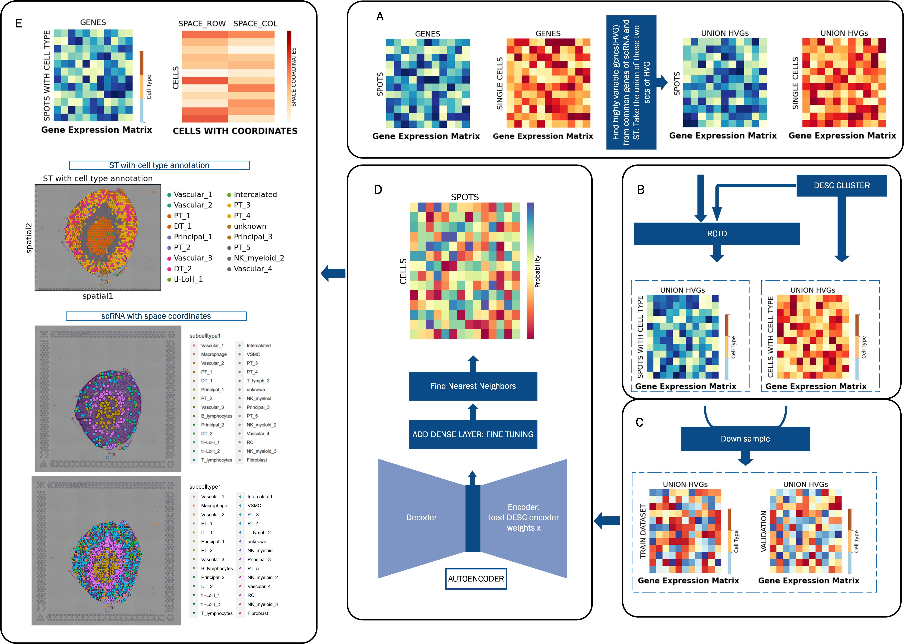

# A Quick Tour of COSCST

<!-- PROJECT LOGO -->
<br />

<p align="center">
  <a href="https://github.com/shiy-shiy/SCST/">
    
  </a>

  
  <p align="center">
    COSCST WORKFLOW
    <br />
    <a href="https://github.com/shiy-shiy/SCST/">查看Demo</a>
    ·
    <a href="https://github.com/shiy-shiy/SCST/issues">报告Bug</a>
    ·
    <a href="https://github.com/shiy-shiy/SCST/issues">提出新特性</a>
  </p>

</p>

Single-cell RNA sequencing data excels in providing high sequencing depth and precision at the single-cell level, but lacks spatial information. Simultaneously, spatial transcriptomics technology visualizes gene expression patterns in their spatial context but has low resolution. Here, we present **COSCST** that combines these two datasets through autoencoder and supervised learning model to map single-cell RNA-seq data with spatial coordination and spatial transcriptomics with precise cell type annotation.

### 1. Installation

To install `COSCST` package you must make sure that your `tensorflow` version `2.x`. You decide to use CPU or GPU to run `tensorflow` according your devices. GPU could accelerate tensorflow by installing `tensorflow-gpu`. In addtation, please make sure your python version is compatible with tensorflow 2.x. In our paper, we used `python 3.6.x` .

We suggest using a separate conda environment for installing `cell2location`.

Create conda environment and install cell2location package

###### 开发前的配置要求

1. xxxxx x.x.x
2. xxxxx x.x.x

###### **安装步骤**

1. Get a free API Key at [https://example.com](https://example.com)
2. Clone the repo

```sh
git clone https://github.com/shiy-shiy / SCST.git
pip install git+git://github.com/shiy-shiy/SCST.git
```

### 2. Data preprocessing


eg:

```
filetree 
├── ARCHITECTURE.md
├── LICENSE.txt
├── README.md
├── /account/
├── /bbs/
├── /docs/
│  ├── /rules/
│  │  ├── backend.txt
│  │  └── frontend.txt
├── manage.py
├── /oa/
├── /static/
├── /templates/
├── useless.md
└── /util/

```


### 开发的架构 

请阅读[ARCHITECTURE.md](https://github.com/shiy-shiy / SCST/blob/master/ARCHITECTURE.md) 查阅为该项目的架构。

### 部署

暂无

### 使用到的框架

- [xxxxxxx](https://getbootstrap.com)
- [xxxxxxx](https://jquery.com)
- [xxxxxxx](https://laravel.com)

### 贡献者

请阅读**CONTRIBUTING.md** 查阅为该项目做出贡献的开发者。

#### 如何参与开源项目

贡献使开源社区成为一个学习、激励和创造的绝佳场所。你所作的任何贡献都是**非常感谢**的。


1. Fork the Project
2. Create your Feature Branch (`git checkout -b feature/AmazingFeature`)
3. Commit your Changes (`git commit -m 'Add some AmazingFeature'`)
4. Push to the Branch (`git push origin feature/AmazingFeature`)
5. Open a Pull Request


### 版本控制

该项目使用Git进行版本管理。您可以在repository参看当前可用版本。

### 作者

xxx@xxxx

知乎:xxxx  &ensp; qq:xxxxxx    

 *您也可以在贡献者名单中参看所有参与该项目的开发者。*

### 版权说明

该项目签署了MIT 授权许可，详情请参阅 [LICENSE.txt](https://github.com/shiy-shiy / SCST/blob/master/LICENSE.txt)

### 鸣谢


- [GitHub Emoji Cheat Sheet](https://www.webpagefx.com/tools/emoji-cheat-sheet)
- [Img Shields](https://shields.io)
- [Choose an Open Source License](https://choosealicense.com)
- [GitHub Pages](https://pages.github.com)
- [Animate.css](https://daneden.github.io/animate.css)
- [xxxxxxxxxxxxxx](https://connoratherton.com/loaders)

<!-- links -->
[your-project-path]:shiy-shiy / SCST
[contributors-shield]: https://img.shields.io/github/contributors/shiy-shiy / SCST.svg?style=flat-square
[contributors-url]: https://github.com/shiy-shiy / SCST/graphs/contributors
[forks-shield]: https://img.shields.io/github/forks/shiy-shiy / SCST.svg?style=flat-square
[forks-url]: https://github.com/shiy-shiy / SCST/network/members
[stars-shield]: https://img.shields.io/github/stars/shiy-shiy / SCST.svg?style=flat-square
[stars-url]: https://github.com/shiy-shiy / SCST/stargazers
[issues-shield]: https://img.shields.io/github/issues/shiy-shiy / SCST.svg?style=flat-square
[issues-url]: https://img.shields.io/github/issues/shiy-shiy / SCST.svg
[license-shield]: https://img.shields.io/github/license/shiy-shiy / SCST.svg?style=flat-square
[license-url]: https://github.com/shiy-shiy / SCST/blob/master/LICENSE.txt
[linkedin-shield]: https://img.shields.io/badge/-LinkedIn-black.svg?style=flat-square&logo=linkedin&colorB=555
[linkedin-url]: https://linkedin.com/in/shaojintian


